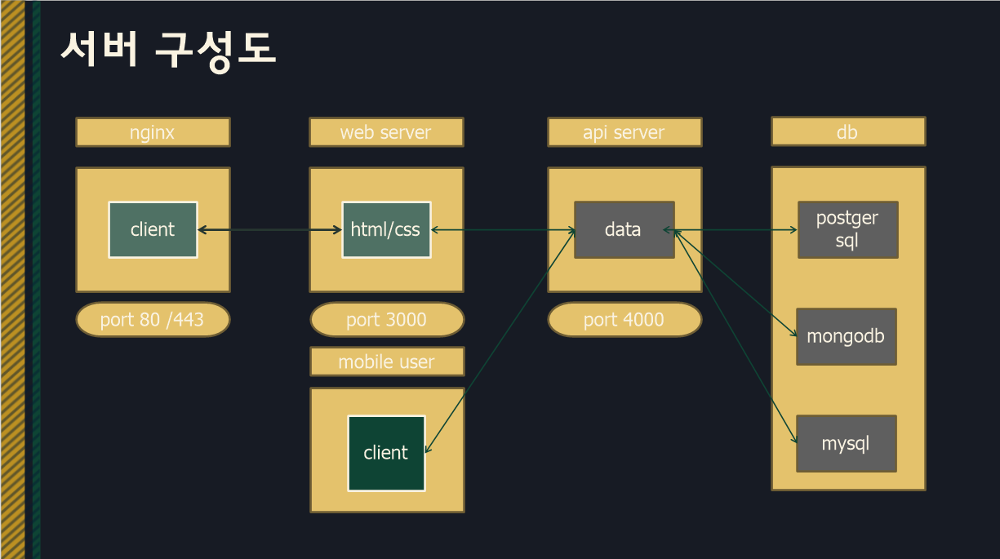
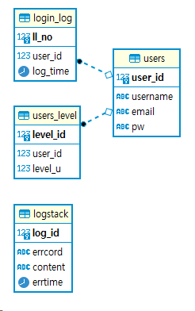

# 질문 답변 게시판
# 프로젝트 소개
## 개요
- 교육기부 동아리 인제간단하죠 전용 시스템
- 시스템 아키텍처

- db 아키텍처

## 기능
- 학생들 작품 자랑하는 기능 플랫폼 제공
- 수업이후 질문이나 관련 자료 공유에 효과적인 기능 제공
- 커리큘럼에 따라 youtube 채널 영상과 동기화

# 패치 노트
- Jkh 1.0.0 - 초기 셋팅
- Jkh 1.0.2 - discord web hook 추가
- jkh 1.0.6 - mysql문 수정
- jkh 1.0.7 - jkh_webhook파일 생성 
- jkh 1.1.0 - java Test01 class제작
- jkh 1.1.1 - db sql동작 함수제작
- jkh 1.1.2 - db sql 생성함수 작성 완료
- jkh 1.3.1 - db sql 종류별 쿼리문 분리
- jkh 1.3.2 - db sql 포스트그래 방식생성

## 이후 지라 이슈와 동기화 처리됨 (기록 x)

# 추후 업데이트 예정
- nginx 도입
- 리눅스 서버 설치
- ncp
- ddns 도입
